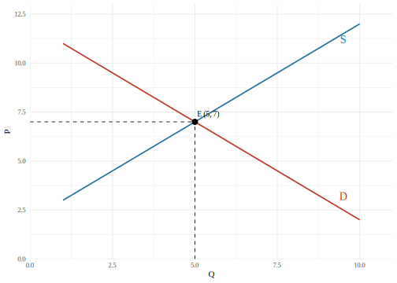



# Introdução {.unnumbered}

Lorem ipsum dolor sit amet, consectetur adipiscing elit, sed do eiusmod tempor incididunt ut labore et dolore magna aliqua. Ut enim ad minim veniam, quis nostrud exercitation ullamco laboris nisi ut aliquip ex ea commodo consequat. Duis aute irure dolor in reprehenderit in voluptate velit esse cillum dolore eu fugiat nulla pariatur. Excepteur sint occaecat cupidatat non proident, sunt in culpa qui officia deserunt mollit anim id est laborum.

# Seção primária

Lorem ipsum dolor sit amet, consectetur adipiscing elit, sed do eiusmod tempor incididunt ut labore et dolore magna aliqua. Ut enim ad minim veniam, quis nostrud exercitation ullamco laboris nisi ut aliquip ex ea commodo consequat. Duis aute irure dolor in reprehenderit in voluptate velit esse cillum dolore eu fugiat nulla pariatur.


::: {#tbl-planets .cell layout-align="center" tbl-cap='Astronomical object'}
::: {.cell-output-display}


|Astronomical object |R (km)  |                       mass (kg)|
|:-------------------|:-------|-------------------------------:|
|Sun                 |696,000 | 1988999999999999901022844480846|
|Earth               |6,371   |       5972000000000000327248442|
|Moon                |1,737   |         73400000000000002196202|
|Mars                |3,390   |        638999999999999976920828|


:::
:::


Lorem ipsum dolor sit amet, consectetur adipiscing elit, sed do eiusmod tempor incididunt ut labore et dolore magna aliqua. Ut enim ad minim veniam, quis nostrud exercitation ullamco laboris nisi ut aliquip ex ea commodo consequat. Duis aute irure dolor in reprehenderit in voluptate velit esse cillum dolore eu fugiat nulla pariatur.

## Seção secundária

Lorem ipsum dolor sit amet, consectetur adipiscing elit, sed do eiusmod tempor incididunt ut labore et dolore magna aliqua. Ut enim ad minim veniam, quis nostrud exercitation ullamco laboris nisi ut aliquip ex ea commodo consequat. Duis aute irure dolor in reprehenderit in voluptate velit esse cillum dolore eu fugiat nulla pariatur @mishkinMonetaryTergetingInflation2000.

{width=4in}

Lorem ipsum dolor sit amet, consectetur adipiscing elit, sed do eiusmod tempor incididunt ut labore et dolore magna aliqua. Ut enim ad minim veniam, quis nostrud exercitation ullamco laboris nisi ut aliquip ex ea commodo consequat. Duis aute irure dolor in reprehenderit in voluptate velit esse cillum dolore eu fugiat nulla pariatur @sargentUnpleasantMonetaristArithmetic1981.

### Seção terciária

Lorem ipsum dolor sit amet, consectetur adipiscing elit, sed do eiusmod tempor incididunt ut labore et dolore magna aliqua. Ut enim ad minim veniam, quis nostrud exercitation ullamco laboris nisi ut aliquip ex ea commodo consequat. Duis aute irure dolor in reprehenderit in voluptate velit esse cillum dolore eu fugiat nulla pariatur:

> "Ut enim ad minima veniam, quis nostrum exercitationem ullam corporis suscipit laboriosam, nisi ut aliquid ex ea commodi consequatur? Quis autem vel eum iure reprehenderit qui in ea voluptate velit esse quam nihil molestiae consequatur, vel illum qui dolorem eum fugiat quo voluptas nulla pariatur." [ @mishkinEconomicsMoneyBanking2011 ]

Lorem ipsum dolor sit amet, consectetur adipiscing elit, sed do eiusmod tempor incididunt ut labore et dolore magna aliqua. Ut enim ad minim veniam, quis nostrud exercitation ullamco laboris nisi ut aliquip ex ea commodo consequat.

#### Seção quaternária

Lorem ipsum dolor sit amet, consectetur adipiscing elit, sed do eiusmod tempor incididunt ut labore et dolore magna aliqua. Ut enim ad minim veniam, quis nostrud exercitation ullamco laboris nisi ut aliquip ex ea commodo consequat.

| Default | Left | Right | Center |
|---------|:-----|------:|:------:|
| 12      | 12   |    12 |   12   |
| 123     | 123  |   123 |  123   |
| 1       | 1    |     1 |   1    |

: Titulo da Tabela {#tbl-qualquer}

Ver @tbl-qualquer.

Lorem ipsum dolor sit amet, consectetur adipiscing elit, sed do eiusmod tempor incididunt ut labore et dolore magna aliqua. Ut enim ad minim veniam, quis nostrud exercitation ullamco laboris nisi ut aliquip ex ea commodo consequat.

# Aspernatur aut odit aut fugit

Sed ut perspiciatis unde omnis iste natus error sit voluptatem accusantium doloremque laudantium, totam rem aperiam, eaque ipsa quae ab illo inventore veritatis et quasi architecto beatae vitae dicta sunt explicabo. Nemo enim ipsam voluptatem quia voluptas sit aspernatur aut odit aut fugit, sed quia consequuntur magni dolores eos qui ratione voluptatem sequi nesciunt. Neque porro quisquam est, qui dolorem ipsum quia dolor sit amet, consectetur, adipisci velit. 


::: {#tbl-mtcars-sample .cell layout-align="center" tbl-cap='Consumo e deslocamento de automóveis selecionados, 1973-74'}
::: {.cell-output-display}

```{=html}
<div id="xjikqpdfti" style="padding-left:0px;padding-right:0px;padding-top:10px;padding-bottom:10px;overflow-x:auto;overflow-y:auto;width:auto;height:auto;">
<style>#xjikqpdfti table {
  font-family: system-ui, 'Segoe UI', Roboto, Helvetica, Arial, sans-serif, 'Apple Color Emoji', 'Segoe UI Emoji', 'Segoe UI Symbol', 'Noto Color Emoji';
  -webkit-font-smoothing: antialiased;
  -moz-osx-font-smoothing: grayscale;
}

#xjikqpdfti thead, #xjikqpdfti tbody, #xjikqpdfti tfoot, #xjikqpdfti tr, #xjikqpdfti td, #xjikqpdfti th {
  border-style: none;
}

#xjikqpdfti p {
  margin: 0;
  padding: 0;
}

#xjikqpdfti .gt_table {
  display: table;
  border-collapse: collapse;
  line-height: normal;
  margin-left: auto;
  margin-right: auto;
  color: #333333;
  font-size: 16px;
  font-weight: normal;
  font-style: normal;
  background-color: rgba(255, 255, 255, 0);
  width: auto;
  border-top-style: solid;
  border-top-width: 1px;
  border-top-color: #A8A8A8;
  border-right-style: none;
  border-right-width: 2px;
  border-right-color: #D3D3D3;
  border-bottom-style: solid;
  border-bottom-width: 1px;
  border-bottom-color: #A8A8A8;
  border-left-style: none;
  border-left-width: 2px;
  border-left-color: #D3D3D3;
}

#xjikqpdfti .gt_caption {
  padding-top: 4px;
  padding-bottom: 4px;
}

#xjikqpdfti .gt_title {
  color: #333333;
  font-size: 125%;
  font-weight: initial;
  padding-top: 4px;
  padding-bottom: 4px;
  padding-left: 5px;
  padding-right: 5px;
  border-bottom-color: rgba(255, 255, 255, 0);
  border-bottom-width: 0;
}

#xjikqpdfti .gt_subtitle {
  color: #333333;
  font-size: 85%;
  font-weight: initial;
  padding-top: 3px;
  padding-bottom: 5px;
  padding-left: 5px;
  padding-right: 5px;
  border-top-color: rgba(255, 255, 255, 0);
  border-top-width: 0;
}

#xjikqpdfti .gt_heading {
  background-color: rgba(255, 255, 255, 0);
  text-align: center;
  border-bottom-color: rgba(255, 255, 255, 0);
  border-left-style: none;
  border-left-width: 1px;
  border-left-color: #D3D3D3;
  border-right-style: none;
  border-right-width: 1px;
  border-right-color: #D3D3D3;
}

#xjikqpdfti .gt_bottom_border {
  border-bottom-style: solid;
  border-bottom-width: 2px;
  border-bottom-color: #D3D3D3;
}

#xjikqpdfti .gt_col_headings {
  border-top-style: solid;
  border-top-width: 2px;
  border-top-color: #D3D3D3;
  border-bottom-style: solid;
  border-bottom-width: 1px;
  border-bottom-color: #D3D3D3;
  border-left-style: none;
  border-left-width: 1px;
  border-left-color: #D3D3D3;
  border-right-style: none;
  border-right-width: 1px;
  border-right-color: #D3D3D3;
}

#xjikqpdfti .gt_col_heading {
  color: #333333;
  background-color: rgba(255, 255, 255, 0);
  font-size: 100%;
  font-weight: normal;
  text-transform: inherit;
  border-left-style: none;
  border-left-width: 1px;
  border-left-color: #D3D3D3;
  border-right-style: none;
  border-right-width: 1px;
  border-right-color: #D3D3D3;
  vertical-align: bottom;
  padding-top: 5px;
  padding-bottom: 6px;
  padding-left: 5px;
  padding-right: 5px;
  overflow-x: hidden;
}

#xjikqpdfti .gt_column_spanner_outer {
  color: #333333;
  background-color: rgba(255, 255, 255, 0);
  font-size: 100%;
  font-weight: normal;
  text-transform: inherit;
  padding-top: 0;
  padding-bottom: 0;
  padding-left: 4px;
  padding-right: 4px;
}

#xjikqpdfti .gt_column_spanner_outer:first-child {
  padding-left: 0;
}

#xjikqpdfti .gt_column_spanner_outer:last-child {
  padding-right: 0;
}

#xjikqpdfti .gt_column_spanner {
  border-bottom-style: solid;
  border-bottom-width: 1px;
  border-bottom-color: #D3D3D3;
  vertical-align: bottom;
  padding-top: 5px;
  padding-bottom: 5px;
  overflow-x: hidden;
  display: inline-block;
  width: 100%;
}

#xjikqpdfti .gt_spanner_row {
  border-bottom-style: hidden;
}

#xjikqpdfti .gt_group_heading {
  padding-top: 8px;
  padding-bottom: 8px;
  padding-left: 5px;
  padding-right: 5px;
  color: #333333;
  background-color: rgba(255, 255, 255, 0);
  font-size: 100%;
  font-weight: initial;
  text-transform: inherit;
  border-top-style: solid;
  border-top-width: 2px;
  border-top-color: #D3D3D3;
  border-bottom-style: solid;
  border-bottom-width: 2px;
  border-bottom-color: #D3D3D3;
  border-left-style: none;
  border-left-width: 1px;
  border-left-color: #D3D3D3;
  border-right-style: none;
  border-right-width: 1px;
  border-right-color: #D3D3D3;
  vertical-align: middle;
  text-align: left;
}

#xjikqpdfti .gt_empty_group_heading {
  padding: 0.5px;
  color: #333333;
  background-color: rgba(255, 255, 255, 0);
  font-size: 100%;
  font-weight: initial;
  border-top-style: solid;
  border-top-width: 2px;
  border-top-color: #D3D3D3;
  border-bottom-style: solid;
  border-bottom-width: 2px;
  border-bottom-color: #D3D3D3;
  vertical-align: middle;
}

#xjikqpdfti .gt_from_md > :first-child {
  margin-top: 0;
}

#xjikqpdfti .gt_from_md > :last-child {
  margin-bottom: 0;
}

#xjikqpdfti .gt_row {
  padding-top: 8px;
  padding-bottom: 8px;
  padding-left: 5px;
  padding-right: 5px;
  margin: 10px;
  border-top-style: none;
  border-top-width: 1px;
  border-top-color: #D3D3D3;
  border-left-style: none;
  border-left-width: 1px;
  border-left-color: #D3D3D3;
  border-right-style: none;
  border-right-width: 1px;
  border-right-color: #D3D3D3;
  vertical-align: middle;
  overflow-x: hidden;
}

#xjikqpdfti .gt_stub {
  color: #333333;
  background-color: rgba(255, 255, 255, 0);
  font-size: 100%;
  font-weight: initial;
  text-transform: inherit;
  border-right-style: solid;
  border-right-width: 2px;
  border-right-color: #D3D3D3;
  padding-left: 5px;
  padding-right: 5px;
}

#xjikqpdfti .gt_stub_row_group {
  color: #333333;
  background-color: rgba(255, 255, 255, 0);
  font-size: 100%;
  font-weight: initial;
  text-transform: inherit;
  border-right-style: solid;
  border-right-width: 2px;
  border-right-color: #D3D3D3;
  padding-left: 5px;
  padding-right: 5px;
  vertical-align: top;
}

#xjikqpdfti .gt_row_group_first td {
  border-top-width: 2px;
}

#xjikqpdfti .gt_row_group_first th {
  border-top-width: 2px;
}

#xjikqpdfti .gt_summary_row {
  color: #333333;
  background-color: rgba(255, 255, 255, 0);
  text-transform: inherit;
  padding-top: 8px;
  padding-bottom: 8px;
  padding-left: 5px;
  padding-right: 5px;
}

#xjikqpdfti .gt_first_summary_row {
  border-top-style: solid;
  border-top-color: #D3D3D3;
}

#xjikqpdfti .gt_first_summary_row.thick {
  border-top-width: 2px;
}

#xjikqpdfti .gt_last_summary_row {
  padding-top: 8px;
  padding-bottom: 8px;
  padding-left: 5px;
  padding-right: 5px;
  border-bottom-style: solid;
  border-bottom-width: 2px;
  border-bottom-color: #D3D3D3;
}

#xjikqpdfti .gt_grand_summary_row {
  color: #333333;
  background-color: rgba(255, 255, 255, 0);
  text-transform: inherit;
  padding-top: 8px;
  padding-bottom: 8px;
  padding-left: 5px;
  padding-right: 5px;
}

#xjikqpdfti .gt_first_grand_summary_row {
  padding-top: 8px;
  padding-bottom: 8px;
  padding-left: 5px;
  padding-right: 5px;
  border-top-style: double;
  border-top-width: 6px;
  border-top-color: #D3D3D3;
}

#xjikqpdfti .gt_last_grand_summary_row_top {
  padding-top: 8px;
  padding-bottom: 8px;
  padding-left: 5px;
  padding-right: 5px;
  border-bottom-style: double;
  border-bottom-width: 6px;
  border-bottom-color: #D3D3D3;
}

#xjikqpdfti .gt_striped {
  background-color: rgba(128, 128, 128, 0.05);
}

#xjikqpdfti .gt_table_body {
  border-top-style: solid;
  border-top-width: 2px;
  border-top-color: #D3D3D3;
  border-bottom-style: solid;
  border-bottom-width: 2px;
  border-bottom-color: #D3D3D3;
}

#xjikqpdfti .gt_footnotes {
  color: #333333;
  background-color: rgba(255, 255, 255, 0);
  border-bottom-style: none;
  border-bottom-width: 2px;
  border-bottom-color: #D3D3D3;
  border-left-style: none;
  border-left-width: 2px;
  border-left-color: #D3D3D3;
  border-right-style: none;
  border-right-width: 2px;
  border-right-color: #D3D3D3;
}

#xjikqpdfti .gt_footnote {
  margin: 0px;
  font-size: 90%;
  padding-top: 4px;
  padding-bottom: 4px;
  padding-left: 5px;
  padding-right: 5px;
}

#xjikqpdfti .gt_sourcenotes {
  color: #333333;
  background-color: rgba(255, 255, 255, 0);
  border-bottom-style: none;
  border-bottom-width: 2px;
  border-bottom-color: #D3D3D3;
  border-left-style: none;
  border-left-width: 2px;
  border-left-color: #D3D3D3;
  border-right-style: none;
  border-right-width: 2px;
  border-right-color: #D3D3D3;
}

#xjikqpdfti .gt_sourcenote {
  font-size: 90%;
  padding-top: 4px;
  padding-bottom: 4px;
  padding-left: 5px;
  padding-right: 5px;
}

#xjikqpdfti .gt_left {
  text-align: left;
}

#xjikqpdfti .gt_center {
  text-align: center;
}

#xjikqpdfti .gt_right {
  text-align: right;
  font-variant-numeric: tabular-nums;
}

#xjikqpdfti .gt_font_normal {
  font-weight: normal;
}

#xjikqpdfti .gt_font_bold {
  font-weight: bold;
}

#xjikqpdfti .gt_font_italic {
  font-style: italic;
}

#xjikqpdfti .gt_super {
  font-size: 65%;
}

#xjikqpdfti .gt_footnote_marks {
  font-size: 75%;
  vertical-align: 0.4em;
  position: initial;
}

#xjikqpdfti .gt_asterisk {
  font-size: 100%;
  vertical-align: 0;
}

#xjikqpdfti .gt_indent_1 {
  text-indent: 5px;
}

#xjikqpdfti .gt_indent_2 {
  text-indent: 10px;
}

#xjikqpdfti .gt_indent_3 {
  text-indent: 15px;
}

#xjikqpdfti .gt_indent_4 {
  text-indent: 20px;
}

#xjikqpdfti .gt_indent_5 {
  text-indent: 25px;
}

#xjikqpdfti .katex-display {
  display: inline-flex !important;
  margin-bottom: 0.75em !important;
}

#xjikqpdfti div.Reactable > div.rt-table > div.rt-thead > div.rt-tr.rt-tr-group-header > div.rt-th-group:after {
  height: 0px !important;
}
</style>
<table class="gt_table" data-quarto-disable-processing="false" data-quarto-bootstrap="false">
  <thead>
    <tr class="gt_col_headings">
      <th class="gt_col_heading gt_columns_bottom_border gt_right" rowspan="1" colspan="1" scope="col" id="mpg">mpg</th>
      <th class="gt_col_heading gt_columns_bottom_border gt_right" rowspan="1" colspan="1" scope="col" id="cyl">cyl</th>
      <th class="gt_col_heading gt_columns_bottom_border gt_right" rowspan="1" colspan="1" scope="col" id="disp">disp</th>
    </tr>
  </thead>
  <tbody class="gt_table_body">
    <tr><td headers="mpg" class="gt_row gt_right">21,0</td>
<td headers="cyl" class="gt_row gt_right">6</td>
<td headers="disp" class="gt_row gt_right">160</td></tr>
    <tr><td headers="mpg" class="gt_row gt_right">21,0</td>
<td headers="cyl" class="gt_row gt_right">6</td>
<td headers="disp" class="gt_row gt_right">160</td></tr>
    <tr><td headers="mpg" class="gt_row gt_right">22,8</td>
<td headers="cyl" class="gt_row gt_right">4</td>
<td headers="disp" class="gt_row gt_right">108</td></tr>
    <tr><td headers="mpg" class="gt_row gt_right">21,4</td>
<td headers="cyl" class="gt_row gt_right">6</td>
<td headers="disp" class="gt_row gt_right">258</td></tr>
    <tr><td headers="mpg" class="gt_row gt_right">18,7</td>
<td headers="cyl" class="gt_row gt_right">8</td>
<td headers="disp" class="gt_row gt_right">360</td></tr>
    <tr><td headers="mpg" class="gt_row gt_right">18,1</td>
<td headers="cyl" class="gt_row gt_right">6</td>
<td headers="disp" class="gt_row gt_right">225</td></tr>
  </tbody>
  <tfoot>
    <tr class="gt_sourcenotes">
      <td class="gt_sourcenote" colspan="3"><span data-qmd-base64="KipGb250ZToqKiBIZW5kZXJzb24gJiBWZWxsZW1hbiAoMTk4MSksICpCdWlsZGluZyBNdWx0aXBsZSBSZWdyZXNzaW9uIE1vZGVscyBJbnRlcmFjdGl2ZWx5Ki4="><span class='gt_from_md'><strong>Fonte:</strong> Henderson &amp; Velleman (1981), <em>Building Multiple Regression Models Interactively</em>.</span></span></td>
    </tr>
    <tr class="gt_sourcenotes">
      <td class="gt_sourcenote" colspan="3"><span data-qmd-base64="KipOb3RhOioqIFZhbG9yZXMgb3JpZ2luYWlzIGVtIHVuaWRhZGVzIGltcGVyaWFpcyAobXBnLCBjdS5pbi4sIGhwKS4="><span class='gt_from_md'><strong>Nota:</strong> Valores originais em unidades imperiais (mpg, cu.in., hp).</span></span></td>
    </tr>
  </tfoot>
</table>
</div>
```

:::
:::


Sed ut perspiciatis unde omnis iste natus error sit voluptatem accusantium doloremque laudantium, totam rem aperiam, eaque ipsa quae ab illo inventore veritatis et quasi architecto beatae vitae dicta sunt explicabo. Nemo enim ipsam voluptatem quia voluptas sit aspernatur aut odit aut fugit, sed quia consequuntur magni dolores eos qui ratione voluptatem sequi nesciunt.



# Conclusão {.unnumbered}

